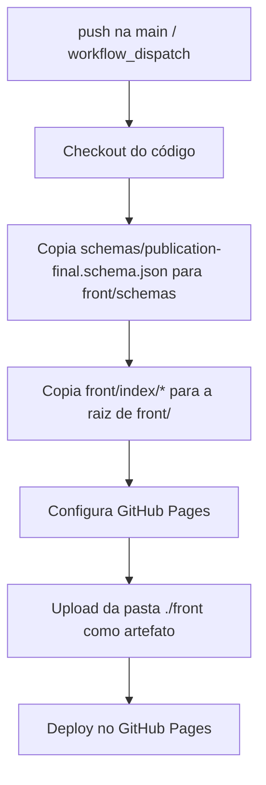

<div align="center">


[🌐 Site](#site) • [✨ Funcionalidades](#funcionalidades) • [🏗️ Arquitetura](#arquitetura) • [🚀 Como rodar](#como-rodar) • [📦 Deploy](#deploy) • [🤝 Contribuindo](#contribuindo)

</div>

---

## Sobre

[#sobre](#sobre)

Este repositório contém o **site oficial do HubSE AI Lab**, publicado via **GitHub Pages**.

O projeto é dividido em `front` (páginas estáticas), `server` (lado servidor), `schemas` (contratos de dados em JSON Schema) e `scripts` (automações), e o deploy é feito automaticamente por **GitHub Actions**.

> 💡 <!-- TODO: adicionar a missão/descrição oficial do laboratório aqui -->

---

## Site

[#site](#site)

🔗 **[hubse-ailab.com.br](http://hubse-ailab.com.br/)**

---

## Funcionalidades

[#funcionalidades](#funcionalidades)

- **Página inicial** do laboratório (`index.html`)
- **Layout compartilhado** entre as páginas (`components/layout.css` e `components/layout.js`)
- **Publicações** exibidas no site, validadas por um schema (`publication-final.schema.json`), cada item com imagem opcional e um logo padrão como fallback
- **Deploy automático** no GitHub Pages a cada push na `main` ou por execução manual
- <!-- TODO: listar as demais páginas/seções (equipe, projetos, contato...) -->

---

## Arquitetura

[#arquitetura](#arquitetura)

Fluxo de deploy (definido em `.github/workflows/deploy.yml`):



### Estrutura do projeto

[#estrutura-do-projeto](#estrutura-do-projeto)

```
hubseailab.github.io/
├── .github/
│   └── workflows/
│       └── deploy.yml         # Publica ./front no GitHub Pages
├── .vscode/                   # Configurações do editor
│
├── front/                     # Site estático (é a pasta publicada)
│   ├── index/                 # Página inicial (index.html)
│   ├── components/            # layout.css · layout.js
│   ├── assets/
│   │   └── logos/             # Logos do laboratório
│   └── ...                    # TODO: demais páginas
│
├── schemas/
│   └── publication-final.schema.json   # Schema das publicações
│
├── scripts/                   # TODO: descrever os scripts
└── server/                    # TODO: descrever o servidor
```

> ⚠️ Os itens dentro de `front/` seguem o que o fluxo de deploy referencia. Confira e ajuste conforme a estrutura real das pastas.

---

## Tecnologias

[#tecnologias](#tecnologias)

| Camada           | Tecnologia                                        |
| ---------------- | ------------------------------------------------- |
| **Front-end**    | HTML · CSS · JavaScript                           |
| **Dados**        | JSON + [JSON Schema](https://json-schema.org)     |
| **CI/CD**        | GitHub Actions (`checkout`, `configure-pages`, `upload-pages-artifact`, `deploy-pages`) |
| **Hospedagem**   | GitHub Pages                                      |
| **Servidor**     | <!-- TODO: informar a tecnologia da pasta server --> |

---

## Como rodar

[#como-rodar](#como-rodar)

### 1. Clone o repositório

```bash
git clone https://github.com/HubSeAILab/hubseailab.github.io.git
cd hubseailab.github.io
```

### 2. Sirva a pasta `front` localmente

Como o site é estático, basta um servidor HTTP simples:

```bash
cd front
python3 -m http.server 8000
```

Abra `http://localhost:8000` no navegador.

> Observação: no deploy, o conteúdo de `front/index/` é copiado para a raiz de `front/`. Localmente, abra `http://localhost:8000/index/` se a página inicial estiver dentro dessa pasta.

### 3. Servidor (opcional)

<!-- TODO: instruções de instalação e execução da pasta server -->

---

## Deploy

[#deploy](#deploy)

O deploy é automático. Ao fazer push na `main` (ou rodar o workflow manualmente em **Actions → Deploy → Run workflow**), o GitHub Actions publica a pasta `./front` no GitHub Pages.

> Para funcionar, em **Settings → Pages** a origem (*Source*) deve estar configurada como **GitHub Actions**.

---

## Contribuindo

[#contribuindo](#contribuindo)

Contribuições são bem-vindas!

1. Faça um **fork** do repositório
2. Crie sua branch — `git checkout -b feature/minha-feature`
3. Faça o commit — `git commit -m "feat: minha feature"`
4. Envie a branch — `git push origin feature/minha-feature`
5. Abra um **Pull Request**

---

## Licença

[#licenca](#licenca)

<!-- TODO: definir a licença do projeto e adicionar o arquivo LICENSE -->

---

<div align="center">

### Feito com 💙 pela equipe do [HubSE AI Lab](https://github.com/HubSeAILab)

**Se este projeto te ajudou, deixe uma ⭐ no repositório!**


</div>
